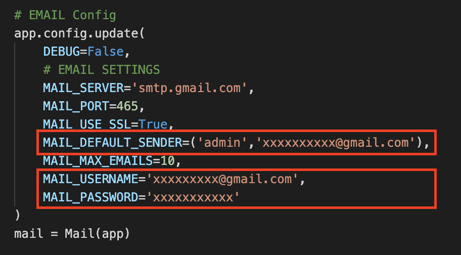
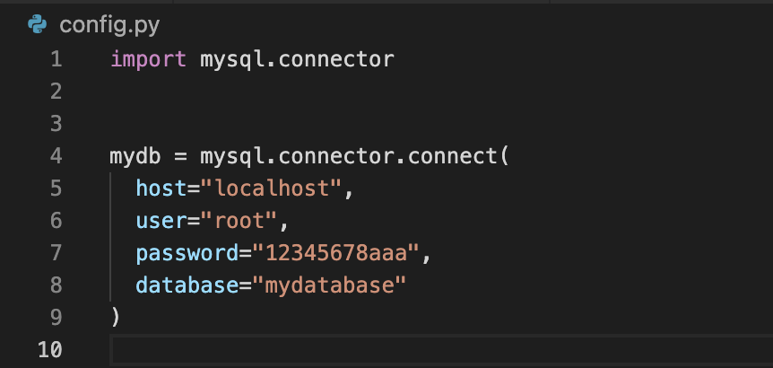

# Birthday Greeting Kata

Build 5 versions of Restiful APIs, Each api can send birthday greeting email when today is their birthday.  
The format of birthday greeting content is json.  

(Extra function: Directly send the mail to the members when today is their birthday)

## Requriements
`python 3.6`  
`mysql 8.0.25`  
`mongodb 5.0.0`    
  
## Instruction
### Step1: 
If you have `pyenv-virtualenv` 
```
$ source bgk/bin/activate
```
if you don't
```
$ pip3 install -r requirements.txt  
```
### Step2:
Enter your gmail account and password on main.py  
("admin" is the sender's name)
  


### Step3:
Enter your own mysql database (host, user, password, database)  on config.py  

  
  
After the configuration, create the MEMBER table and insert the data from data.csv to mysql & mongodb  
```
$ python3 mysql_setup.py  
$ python3 mongo_setup.py  
```

### Step4:
```
$ python3 main.py
```


